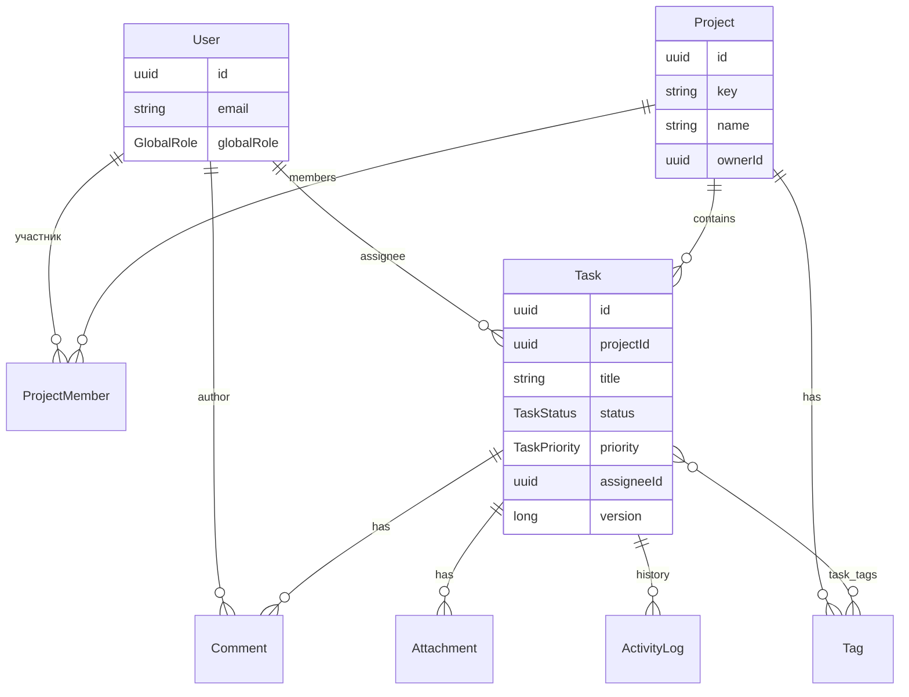

# Task Manager API — справочник эндпоинтов

Полный список REST API для ручного тестирования в Postman и для курса Java AQA.

| | |
|---|---|
| **Sandbox (VPS)** | `http://51.195.82.237:8090` |
| **Локально** | `http://localhost:8080` |
| **OpenAPI** | `/openapi.yaml` |
| **Swagger UI** | `/swagger-ui.html` |
| **Health** | `/actuator/health` |

> **Важно:** на VPS всегда указывай порт **`:8090`**. Без порта (`:80`, `:8080`) откроется другое приложение на сервере.

---

# Доменная модель — сущности и связи

Task Manager — это **учебный таск-трекер** (как упрощённый Jira/Trello). Всё крутится вокруг **проекта** и **задач** внутри него.

## Схема связей



---

## Сущности

### User (пользователь)

Аккаунт в системе. Логинится через email + password, получает JWT.

| Поле | Описание |
|------|----------|
| `id` | UUID |
| `email` | Уникальный логин |
| `firstName`, `lastName` | Имя |
| `globalRole` | `USER` или `ADMIN` |
| `avatarUrl` | Опционально |

**GlobalRole:**
- `ADMIN` — видит всех пользователей, может удалять users, обходит часть project-RBAC
- `USER` — обычный пользователь, права в проектах через `ProjectMember`

**Что можно делать (API):**
- Зарегистрироваться / залогиниться / refresh / logout
- Смотреть свой профиль (`/auth/me`, `/users/me/profile`)
- ADMIN: список всех users, delete user
- Смотреть задачи, где user — assignee (`/users/{id}/tasks`)

---

### Project (проект)

Контейнер для задач и команды. В sandbox есть seed-проект **`DEMO`**.

| Поле | Описание |
|------|----------|
| `id` | UUID — нужен для `projectId` при создании задач |
| `key` | Короткий код, уникальный (`DEMO`, `MYPRJ`) |
| `name`, `description` | Название и описание |
| `ownerId` | UUID создателя (OWNER) |
| `archived` | Архивный проект или нет |

**Что можно делать (API):**
- CRUD проекта (`/projects`, `/projects/{id}`)
- Смотреть / добавлять / удалять **участников** (`/projects/{id}/members`)
- Фильтровать список: `?archived=false`, пагинация `?size=20`

**Кто может:**
| Действие | OWNER | ADMIN | MEMBER | VIEWER | Global ADMIN |
|----------|-------|-------|--------|--------|--------------|
| Читать проект | ✅ | ✅ | ✅ | ✅ | ✅ |
| Создавать задачи | ✅ | ✅ | ✅ | ❌ | ✅ |
| Редактировать проект | ✅ | ✅ | ❌ | ❌ | ✅ |
| Управлять участниками | ✅ | ✅ | ❌ | ❌ | ✅ |

---

### ProjectMember (участник проекта)

Связь **User ↔ Project** с ролью внутри проекта.

| Поле | Описание |
|------|----------|
| `projectId`, `userId` | Связь |
| `role` | `OWNER`, `ADMIN`, `MEMBER`, `VIEWER` |

**ProjectRole — что означает:**
| Роль | Чтение | Создание/правка задач | Админ проекта |
|------|--------|----------------------|---------------|
| `OWNER` | ✅ | ✅ | ✅ |
| `ADMIN` | ✅ | ✅ | ✅ |
| `MEMBER` | ✅ | ✅ | ❌ |
| `VIEWER` | ✅ | ❌ | ❌ |

Demo: `qa@demo.com` = **MEMBER**, `viewer@demo.com` = **VIEWER**.

---

### Task (задача)

Главная сущность. Живёт **строго в одном проекте** (`projectId`).

| Поле | Описание |
|------|----------|
| `id` | UUID задачи |
| `projectId` | К какому проекту относится |
| `title`, `description` | Текст |
| `status` | Статус на Kanban-доске |
| `priority` | `LOW`, `MEDIUM`, `HIGH`, `CRITICAL` |
| `assigneeId` | UUID исполнителя (null = не назначена) |
| `dueDate` | Дедлайн (опционально) |
| `version` | Optimistic lock — передавать при PATCH |
| `deletedAt` | Soft delete — удалённые не видны в API |

**При создании:** `status = TODO`, `version = 0`.

**Жизненный цикл статусов (Kanban):**

```
TODO ──→ IN_PROGRESS ──→ REVIEW ──→ DONE
  │           │            │
  └───────────┴────────────┴──→ CANCELLED (из TODO / IN_PROGRESS / REVIEW / DONE)
```

| Из статуса | Можно перейти в |
|------------|-----------------|
| `TODO` | `IN_PROGRESS`, `CANCELLED` |
| `IN_PROGRESS` | `REVIEW`, `TODO`, `CANCELLED` |
| `REVIEW` | `DONE`, `IN_PROGRESS`, `CANCELLED` |
| `DONE` | `CANCELLED` |
| `CANCELLED` | *(никуда)* |

**Что можно делать (API):**
- Список с фильтрами (`/tasks?projectId=&status=&priority=…`)
- Поиск (`/tasks/search?q=login`)
- CRUD (`/tasks`, `/tasks/{id}`)
- Смена статуса (`/tasks/{id}/status`) — отдельная ручка
- Назначить исполнителя (`/tasks/{id}/assignee`)
- Bulk update до 50 id (`/tasks/bulk-update`)
- Комментарии, вложения, history, теги

---

### Comment (комментарий)

Текстовый комментарий к задаче.

| Поле | Описание |
|------|----------|
| `taskId` | К какой задаче |
| `authorId` | Кто написал |
| `body` | Текст (до 4000 символов) |
| `version` | Optimistic lock при редактировании |

**Что можно делать:**
- Список / создать через `/tasks/{id}/comments`
- Получить / править / удалить через `/comments/{commentId}`
- Редактировать может **автор** или **global ADMIN**

---

### Tag (тег)

Метка внутри проекта (цвет + имя). В DEMO: `bug`, `feature`.

| Поле | Описание |
|------|----------|
| `projectId` | Тег принадлежит проекту |
| `name`, `color` | `#EF4444` и т.д. |

**Связь с задачей:** many-to-many через `task_tags`.

**Что можно делать:**
- Список тегов проекта: `GET /tags?projectId=`
- Привязать к задаче: `POST /tasks/{taskId}/tags/{tagId}`

---

### Attachment (вложение)

Файл, прикреплённый к задаче (png, jpeg, pdf, txt; max 5 MB).

**Что можно делать:**
- Загрузить: `POST /tasks/{taskId}/attachments` (multipart `file`)

---

### ActivityLog (история)

Запись о действии над задачей (создана, статус изменён, assignee, …).

**Что можно делать:**
- `GET /tasks/{taskId}/history` — лента событий

---

### RefreshToken (служебная)

Хранит refresh token для JWT. Не отдельный REST-ресурс — используется в `/auth/refresh` и `/auth/logout`.

---

## Два уровня прав (важно для тестов)

```
1. GlobalRole (User)     →  ADMIN видит всё в системе
2. ProjectRole (Member)  →  права внутри конкретного проекта
```

Пример: `qa@demo.com` — global **USER**, но в DEMO — **MEMBER** → может создавать задачи.  
`viewer@demo.com` — **VIEWER** → только читает, POST `/tasks` вернёт **403**.

---

## Типовой поток данных (Postman)

```
User ──login──→ JWT accessToken
       │
       ├──→ Project (DEMO) ──→ projectId
       │         │
       │         ├──→ Task (create/list/update/delete)
       │         │       ├──→ Comment
       │         │       ├──→ Attachment
       │         │       ├──→ Tag (link)
       │         │       └──→ History
       │         │
       │         └──→ ProjectMember (кто в команде)
       │
       └──→ Stats (/stats/dashboard?projectId=)
```

---

## Seed-данные sandbox (profile prod/dev)

После деплоя уже есть:

| Сущность | Что внутри |
|----------|------------|
| Users | admin, lead, qa, viewer @demo.com |
| Project | `DEMO` — Demo Project |
| Tasks | ~5 задач в разных статусах |
| Tags | `bug`, `feature` |
| Members | admin=OWNER, lead=ADMIN, qa=MEMBER, viewer=VIEWER |

Пароль всех demo-users: **`Demo123!`**

---


Большинство ручек требуют JWT:

```
Authorization: Bearer <accessToken>
```

Токен получают через `POST /api/v1/auth/login`.

### Публичные (без токена)

- `POST /api/v1/auth/register`
- `POST /api/v1/auth/login`
- `POST /api/v1/auth/refresh`
- `POST /api/v1/auth/forgot-password`
- `GET /actuator/health`
- `GET /swagger-ui.html`, `/openapi.yaml`, `/v3/api-docs`

---

## Demo-пользователи (sandbox)

| Email | Password | Роль |
|-------|----------|------|
| `qa@demo.com` | `Demo123!` | USER, в проекте DEMO — MEMBER |
| `admin@demo.com` | `Demo123!` | ADMIN |
| `lead@demo.com` | `Demo123!` | USER, в DEMO — ADMIN |
| `viewer@demo.com` | `Demo123!` | USER, в DEMO — VIEWER (только чтение) |

В seed есть проект **`DEMO`** — его `id` (UUID) нужен для создания задач.

---

## Пагинация (query-параметры)

Используется в списках (`projects`, `tasks`, `users`, …):

| Параметр | Описание | Пример |
|----------|----------|--------|
| `page` | Номер страницы, с **0** | `page=0` |
| `size` | Записей на странице | `size=20` |
| `sort` | Сортировка | `sort=createdAt,desc` |

Ответ: `{ "content": [...], "meta": { "page", "size", "totalElements", "totalPages" } }`.

---

## Формат ошибок

```json
{
  "code": "VALIDATION_ERROR",
  "message": "Request validation failed",
  "details": [{ "field": "title", "message": "..." }],
  "timestamp": "2026-08-23T06:00:00Z",
  "path": "/api/v1/tasks"
}
```

Коды: `UNAUTHORIZED`, `FORBIDDEN`, `NOT_FOUND`, `VALIDATION_ERROR`, `CONFLICT`, `UNPROCESSABLE_ENTITY`.

---

## Enums

| Поле | Значения |
|------|----------|
| `TaskStatus` | `TODO`, `IN_PROGRESS`, `REVIEW`, `DONE`, `CANCELLED` |
| `TaskPriority` | `LOW`, `MEDIUM`, `HIGH`, `CRITICAL` |
| `GlobalRole` | `USER`, `ADMIN` |
| `ProjectRole` | `OWNER`, `ADMIN`, `MEMBER`, `VIEWER` |

---

# Auth — `/api/v1/auth`

## POST `/api/v1/auth/register`

Регистрация + выдача JWT. **Токен не нужен.**

**URL:** `http://51.195.82.237:8090/api/v1/auth/register`

**Body:**
```json
{
  "email": "new.user@demo.com",
  "password": "Demo123!",
  "firstName": "New",
  "lastName": "User"
}
```

**Ответ:** `201` — `accessToken`, `refreshToken`, `user`.

---

## POST `/api/v1/auth/login`

Вход. **Токен не нужен.**

**URL:** `http://51.195.82.237:8090/api/v1/auth/login`

**Body:**
```json
{
  "email": "qa@demo.com",
  "password": "Demo123!"
}
```

**Ответ:** `200` — `accessToken`, `refreshToken`, `user`.

---

## POST `/api/v1/auth/refresh`

Новая пара токенов по refresh. **Токен не нужен.**

**URL:** `http://51.195.82.237:8090/api/v1/auth/refresh`

**Body:**
```json
{
  "refreshToken": "<refreshToken из login>"
}
```

**Ответ:** `200` — новые `accessToken`, `refreshToken`.

---

## POST `/api/v1/auth/logout`

Отзыв refresh token. **Bearer обязателен.**

**URL:** `http://51.195.82.237:8090/api/v1/auth/logout`

**Body:**
```json
{
  "refreshToken": "<refreshToken>"
}
```

**Ответ:** `204` No Content.

---

## GET `/api/v1/auth/me`

Текущий пользователь по JWT.

**URL:** `http://51.195.82.237:8090/api/v1/auth/me`

**Ответ:** `200` — `id`, `email`, `firstName`, `lastName`, `globalRole`.

---

## POST `/api/v1/auth/forgot-password`

Запрос сброса пароля (sandbox: всегда `202`). **Токен не нужен.**

**URL:** `http://51.195.82.237:8090/api/v1/auth/forgot-password`

**Body:**
```json
{
  "email": "qa@demo.com"
}
```

**Ответ:** `202` Accepted.

---

# Users — `/api/v1/users`

## GET `/api/v1/users`

Список пользователей. **Только ADMIN.**

**URL:** `http://51.195.82.237:8090/api/v1/users?page=0&size=20`

**Query:** `q` (поиск), `page`, `size`, `sort`.

**Ответ:** `200` — страница `UserResponse`.

---

## GET `/api/v1/users/me/profile`

Расширенный профиль текущего пользователя.

**URL:** `http://51.195.82.237:8090/api/v1/users/me/profile`

**Ответ:** `200` — профиль + счётчики задач/проектов.

---

## GET `/api/v1/users/{userId}`

Пользователь по UUID.

**URL:** `http://51.195.82.237:8090/api/v1/users/{userId}`

**Ответ:** `200` / `404`.

---

## PATCH `/api/v1/users/{userId}`

Обновление пользователя (self или ADMIN).

**URL:** `http://51.195.82.237:8090/api/v1/users/{userId}`

**Body (все поля опциональны):**
```json
{
  "firstName": "QA",
  "lastName": "Engineer",
  "avatarUrl": "https://example.com/avatar.png"
}
```

**Ответ:** `200`.

---

## DELETE `/api/v1/users/{userId}`

Soft delete пользователя. **Только ADMIN.**

**URL:** `http://51.195.82.237:8090/api/v1/users/{userId}`

**Ответ:** `204`.

---

## GET `/api/v1/users/{userId}/tasks`

Задачи, где пользователь — assignee.

**URL:** `http://51.195.82.237:8090/api/v1/users/{userId}/tasks?status=TODO&page=0&size=20`

**Query:** `status`, `page`, `size`.

**Ответ:** `200` — страница задач.

---

# Projects — `/api/v1/projects`

## GET `/api/v1/projects`

Список проектов, доступных текущему пользователю.

**URL:** `http://51.195.82.237:8090/api/v1/projects?size=20`

**Query:**

| Параметр | Описание |
|----------|----------|
| `archived` | `true` / `false` (default `false`) |
| `page` | Страница |
| `size` | **Размер страницы** — `size=20` вернёт до 20 проектов |

**Ответ:** `200` — в `content[]` ищи проект с `"key": "DEMO"`, сохрани `"id"` как `projectId`.

---

## POST `/api/v1/projects`

Создание проекта. Создатель = OWNER.

**URL:** `http://51.195.82.237:8090/api/v1/projects`

**Body:**
```json
{
  "name": "My Project",
  "description": "Optional description",
  "key": "MYPRJ"
}
```

**Ответ:** `201`.

---

## GET `/api/v1/projects/{projectId}`

Детали проекта + участники + счётчики.

**URL:** `http://51.195.82.237:8090/api/v1/projects/{projectId}`

**Ответ:** `200` / `403` / `404`.

---

## PATCH `/api/v1/projects/{projectId}`

Обновление (OWNER/ADMIN проекта).

**URL:** `http://51.195.82.237:8090/api/v1/projects/{projectId}`

**Body:**
```json
{
  "name": "Updated name",
  "description": "New description",
  "archived": false
}
```

**Ответ:** `200`.

---

## DELETE `/api/v1/projects/{projectId}`

Удаление проекта.

**URL:** `http://51.195.82.237:8090/api/v1/projects/{projectId}`

**Ответ:** `204`.

---

## GET `/api/v1/projects/{projectId}/members`

Участники проекта.

**URL:** `http://51.195.82.237:8090/api/v1/projects/{projectId}/members`

**Ответ:** `200` — массив `{ userId, role, ... }`.

---

## POST `/api/v1/projects/{projectId}/members`

Добавить участника.

**URL:** `http://51.195.82.237:8090/api/v1/projects/{projectId}/members`

**Body:**
```json
{
  "userId": "<uuid пользователя>",
  "role": "MEMBER"
}
```

**Ответ:** `201`.

---

## DELETE `/api/v1/projects/{projectId}/members/{memberUserId}`

Удалить участника (не OWNER).

**URL:** `http://51.195.82.237:8090/api/v1/projects/{projectId}/members/{memberUserId}`

**Ответ:** `204`.

---

# Tasks — `/api/v1/tasks`

## GET `/api/v1/tasks`

Список задач с фильтрами.

**URL:** `http://51.195.82.237:8090/api/v1/tasks?projectId={uuid}&size=10`

**Query:**

| Параметр | Описание |
|----------|----------|
| `projectId` | UUID проекта |
| `status` | `TODO`, `IN_PROGRESS`, … |
| `priority` | `LOW`, `MEDIUM`, `HIGH`, `CRITICAL` |
| `assigneeId` | UUID исполнителя |
| `tag` | UUID тега |
| `dueBefore` | ISO datetime |
| `dueAfter` | ISO datetime |
| `page`, `size`, `sort` | Пагинация |

**Ответ:** `200` — `{ content: [TaskResponse...], meta }`.

---

## POST `/api/v1/tasks`

Создание задачи.

**URL:** `http://51.195.82.237:8090/api/v1/tasks`

**Body:**
```json
{
  "projectId": "<uuid проекта DEMO>",
  "title": "Fix login validation",
  "description": "Optional text",
  "priority": "HIGH",
  "dueDate": "2026-09-01T00:00:00Z",
  "assigneeId": null
}
```

Обязательны: `projectId`, `title`, `priority`.

**Ответ:** `201` — задача со `status: TODO`, `version: 0`.

---

## GET `/api/v1/tasks/search`

Поиск по тексту (мин. 2 символа).

**URL:** `http://51.195.82.237:8090/api/v1/tasks/search?q=login&projectId={uuid}&size=20`

**Query:** `q` (обяз.), `projectId`, `page`, `size`.

**Ответ:** `200` / `422` если `q` короче 2 символов.

---

## POST `/api/v1/tasks/bulk-update`

Массовое обновление (до 50 id).

**URL:** `http://51.195.82.237:8090/api/v1/tasks/bulk-update`

**Body:**
```json
{
  "taskIds": ["uuid1", "uuid2"],
  "status": "IN_PROGRESS",
  "priority": "HIGH",
  "assigneeId": null
}
```

Хотя бы одно из: `status`, `priority`, `assigneeId`.

**Ответ:** `200` — `{ updated, failed[] }`.

---

## GET `/api/v1/tasks/{taskId}`

Детали задачи.

**URL:** `http://51.195.82.237:8090/api/v1/tasks/{taskId}`

**Ответ:** `200` — `{ task, tags[], commentsCount, attachmentsCount }`.

---

## PATCH `/api/v1/tasks/{taskId}`

Обновление полей задачи. **Optimistic lock:** поле `version` обязательно.

**URL:** `http://51.195.82.237:8090/api/v1/tasks/{taskId}`

**Body:**
```json
{
  "title": "New title",
  "description": "Updated",
  "priority": "MEDIUM",
  "dueDate": "2026-10-01T00:00:00Z",
  "version": 0
}
```

**Ответ:** `200` / `409` если version устарела.

---

## DELETE `/api/v1/tasks/{taskId}`

Удаление (soft delete по умолчанию).

**URL:** `http://51.195.82.237:8090/api/v1/tasks/{taskId}`

**Query:** `hard=true` — физическое удаление.

**Ответ:** `204`. Повторный GET → `404`.

---

## PATCH `/api/v1/tasks/{taskId}/status`

Смена статуса.

**URL:** `http://51.195.82.237:8090/api/v1/tasks/{taskId}/status`

**Body:**
```json
{
  "status": "IN_PROGRESS",
  "version": 0
}
```

**Переходы:** TODO→IN_PROGRESS|CANCELLED; IN_PROGRESS→REVIEW|TODO|CANCELLED; REVIEW→DONE|IN_PROGRESS|CANCELLED; DONE→CANCELLED.

**Ответ:** `200` / `422` недопустимый переход / `409` conflict version.

---

## PATCH `/api/v1/tasks/{taskId}/assignee`

Назначить / снять исполнителя.

**URL:** `http://51.195.82.237:8090/api/v1/tasks/{taskId}/assignee`

**Body:**
```json
{
  "assigneeId": "<uuid участника проекта>",
  "version": 0
}
```

`assigneeId: null` — снять назначение.

**Ответ:** `200`.

---

## GET `/api/v1/tasks/{taskId}/comments`

Комментарии задачи.

**URL:** `http://51.195.82.237:8090/api/v1/tasks/{taskId}/comments?page=0&size=50`

**Ответ:** `200` — страница комментариев.

---

## POST `/api/v1/tasks/{taskId}/comments`

Добавить комментарий.

**URL:** `http://51.195.82.237:8090/api/v1/tasks/{taskId}/comments`

**Body:**
```json
{
  "body": "Looks good, please add tests."
}
```

**Ответ:** `201`.

---

## GET `/api/v1/tasks/{taskId}/history`

История изменений (activity log).

**URL:** `http://51.195.82.237:8090/api/v1/tasks/{taskId}/history`

**Ответ:** `200` — массив событий.

---

## POST `/api/v1/tasks/{taskId}/attachments`

Загрузка файла. **multipart/form-data**, поле `file`.

**URL:** `http://51.195.82.237:8090/api/v1/tasks/{taskId}/attachments`

**Postman:** Body → form-data → key `file`, type File.

**Ответ:** `201` / `413` если файл > 5 MB.

---

## POST `/api/v1/tasks/{taskId}/tags/{tagId}`

Привязать тег к задаче.

**URL:** `http://51.195.82.237:8090/api/v1/tasks/{taskId}/tags/{tagId}`

**Ответ:** `204`.

---

# Comments — `/api/v1/comments`

## GET `/api/v1/comments/{commentId}`

**URL:** `http://51.195.82.237:8090/api/v1/comments/{commentId}`

**Ответ:** `200`.

---

## PATCH `/api/v1/comments/{commentId}`

Редактирование (автор или ADMIN). Нужен `version`.

**URL:** `http://51.195.82.237:8090/api/v1/comments/{commentId}`

**Body:**
```json
{
  "body": "Updated comment text",
  "version": 0
}
```

**Ответ:** `200`.

---

## DELETE `/api/v1/comments/{commentId}`

**URL:** `http://51.195.82.237:8090/api/v1/comments/{commentId}`

**Ответ:** `204`.

---

# Tags — `/api/v1/tags`

## GET `/api/v1/tags`

Теги проекта.

**URL:** `http://51.195.82.237:8090/api/v1/tags?projectId={uuid}`

**Ответ:** `200` — массив `{ id, name, color, projectId }`. В DEMO есть теги `bug`, `feature`.

---

# Stats — `/api/v1/stats`

## GET `/api/v1/stats/dashboard`

Статистика для dashboard.

**URL:** `http://51.195.82.237:8090/api/v1/stats/dashboard`

**URL (по проекту):** `http://51.195.82.237:8090/api/v1/stats/dashboard?projectId={uuid}`

**Ответ:** `200` — `totalTasks`, `tasksByStatus`, `tasksByPriority`, `overdueTasks`, …

---

# System

## GET `/actuator/health`

**URL:** `http://51.195.82.237:8090/actuator/health`

**Токен не нужен.**

**Ответ:** `{"status":"UP", ...}`

---

# Типовой сценарий в Postman (руками)

1. `POST /auth/login` → скопировать `accessToken`
2. Authorization → Bearer Token
3. `GET /projects?size=20` → `id` проекта DEMO
4. `POST /tasks` с `projectId`
5. `GET /tasks/{id}`
6. `PATCH /tasks/{id}/status`
7. `DELETE /tasks/{id}`

---

# Связанные файлы

| Файл | Назначение |
|------|------------|
| `Task-Manager-Smoke.postman_collection.json` | Автотесты |
| `Task-Manager-Sandbox-VPS.postman_environment.json` | Environment для VPS |
| `../src/main/resources/static/openapi.yaml` | Каноническая OpenAPI-спека |
